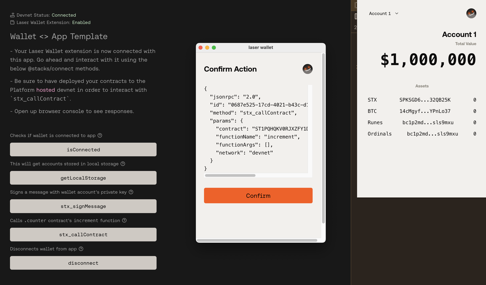
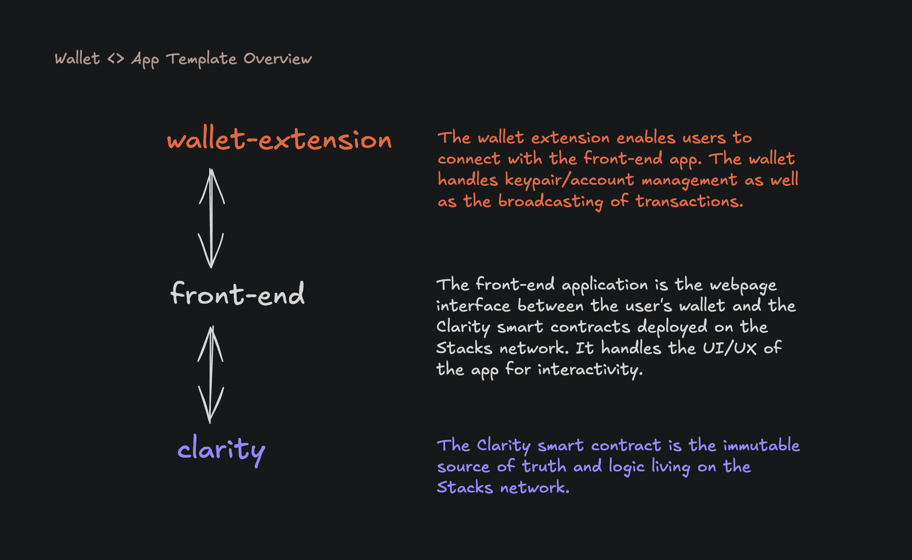

# Wallet <> App Template



This template showcases a minimal setup of a Stacks wallet extension that adheres to the new [@stacks/connect](https://github.com/hirosystems/connect) version and based off of the standards outlined in [WBIP](https://wbips.netlify.app/).

> IMPORTANT: The browser wallet extension template will store the generated mneomic seed phrase in the browser's local storage without any standard encryption best practices. If you plan to use this in a production environment, implement secure best practices for the safe encryption and storage of users' mnemonic seed phrases.

Although this template focuses on providing a starter Stacks wallet extension, it comes with a Clarity smart contract and front-end app to fully test the full-stack interoperability. The template comprises of 3 folders:

- `clarity`: A Clarinet project that houses a simple counter contract.
- `front-end`: A front-end app, powered by Vue/Vite, supporting the new @stacks/connect v8 methods for interacting with the wallet and the Clarity contract.
- `wallet-extension`: A minimally viable wallet extension app, built with Vue/Vite, supporting the new communication standard in how it should interact with Stacks applications.

An overview diagram of how the 3 separate folders work together.



This example template is intended for educational purposes only. The provided smart contracts have not been audited.

## Understanding the Wallet Extension <> Front-End App communication

The diagram below breaks down how the different context scripts (of a Chrome [extension](https://developer.chrome.com/docs/extensions)) communicate with each other starting from when the web page dispatches a request to the wallet extension and back. Diagram taken from [this](https://github.com/wbips/webbtc-extension-template) other excellent template, which is a bit more bare bones but also very clear.

```mermaid
sequenceDiagram
  participant w as web page
  participant c as content.js script
  participant b as background.js script
  participant p as extension popup
  w->>+c: StacksWallet.request<br/>(document.dispatchEvent)
  c->>b: document.addEventListener<br/>(chrome.runtime.sendMessage)
  b->>+p: chrome.runtime.onMessage.addListener<br/>(chrome.windows.create)
  p->>-c: user action<br/>(chrome.tabs.sendMessage)
  c->>-w: chrome.runtime.onMessage.addListener<br/>(window.postMessage)
```

These communication flows are based off of standards like WBIP and SIP-030 to allow wallets to communicate with apps in a more simplified and flexible way.

## Development

To run this app with a Stacks Devnet (private development blockchain environment), follow these steps:

1. **Configure Local Environment**

From the root directory, install dependencies:

```bash
npm install
```

In the `front-end` directory, create an `.env` file using the existing `.env.example` file:

```bash
cp front-end/.env.example front-end/.env
```

Add your Hiro Platform API key to the renamed `front-end/.env` file:

```bash
VITE_PLATFORM_HIRO_API_KEY=your-api-key-here
```

2. **Start Devnet in Hiro Platform**

- Log into the [Hiro Platform](https://platform.hiro.so)
- Navigate to your project and start Devnet (No need to update the Devnet deployment plan if it asks)
- Copy your API key from either:
  - The Devnet Stacks API URL: `https://api.platform.hiro.so/v1/ext/<YOUR-API-KEY>/stacks-blockchain-api`
  - Or from https://platform.hiro.so/settings/api-keys

3. **Bundle and Enable Wallet Extension in Browser**

- Run `npm run build` in the `wallet-extension` directory or `npm run build --workspace=wallet-extension` in the root directory.
- The generated build file will live in a new `dist/` folder which needs to be added as a Chrome extension in your browser:
  1. Enable Developer Mode in browser:
  - Open Chrome and go to [chrome://extensions/](chrome://extensions/).
  - Toggle on the "Developer mode" switch in the top right corner.
  2. Load the Unpacked Extension:
  - Click the "Load unpacked" button near the top left.
  - Navigate to the folder which contains the new `dist/` folder, select it, and click "Select Folder".
  - Chrome will then load and install the extension.
  - Enable and pin the extension to your browser.
  - Click the reload button in the extension card if you make changes to the `dist/` folder.

> Before starting the front-end app, click the Stacks Wallet extension icon in the browser toolbar to open the extension popup and create a new wallet or import an existing 24 mnemonic word seed phrase. Best if you import one of the pre-funded wallets provided in the <code>Devnet.toml</code> file of your Clarinet (clarity) project directory.

4. **Start the Frontend Application**

Start the Vue/Vite application from the `front-end` directory.

```bash
cd front-end
npm run dev
```

Visit `[http://localhost:5173](http://localhost:5173)` in your browser to view and interact with the app. If devnet is running and the wallet extension is enabled in your browser, then you should be able to connect the app with the wallet to interact with the @stacks/connect methods. But before connecting, try opening up the wallet extension icon and creating a wallet first.

But after creating a wallet and connecting it to the app, you'll be able to interact with the provided methods with your wallet. Interaction will consist of a popup of your Stacks wallet extension with the raw JSON RPC 2.0 request object. This object will display information about the request for you to confirm. Open your web page console to see the request and response objects that get sent back and forth.

## Basic default functions of this Stacks wallet

- `App.vue` acts as the entry point for the extension
- Generates random mnemonic seed phrase
- Importing of mnemonic seed phrase
- Creates Stacks and Bitcoin addresses that stem from the same public key
- Injects and registers wallet to document page as `window.StacksWallet`
- Supports @stacks/connect methods

### Securing Mnemonic Seeds

As mentioned earlier, this browser wallet extension template will store the generated mneomic seed phrase in the browser's local storage without any standard encryption best practices. If you plan to use this in a production environment, implement secure best practices for the safe encryption and storage of users' mnemonic seed phrases.

Suggestions on securing mnemonic seed phrases

- Using a combination between user provided password and encryption scheme. Check out [@stacks/encryption](https://github.com/hirosystems/stacks.js/tree/main/packages/encryption) for examples.
- Minimizing exposure in memory and [key persistence](https://github.com/leather-io/extension/discussions/2111)

## About the Smart Contract

This app uses a Clarity smart contract which handles the simple incrementing of a variable.

### `counter.clar`

- `increment`: Allows the incrementing of a uint variable.
- `get-count`: Returns the current uint `count` variable.

## Using Devnet

The Hiro Platform's Devnet is a sandboxed, personal blockchain environment for testing your dApps before deploying them to the testnet or mainnet. Each time you start a new Devnet, it will reset the blockchain state and deploy your project contracts from scratch.

This is useful because deployments to the blockchain are permanent and cannot be undone. Ensure you have tested your contracts thoroughly in your Devnet before promoting them to Testnet or Mainnet.

If you make changes to your contract, you will need to push your changes and restart Devnet for the contract changes to appear in your Devnet.

For this template, the `front-end` directory contains the below environment variables in the `.env` file for you to config your devnet:

- VITE_STACKS_NETWORK=platformdevnet
- VITE_PLATFORM_HIRO_API_KEY=`<YOUR-API-KEY>`

## Next Steps

Once you've thoroughly tested your wallet and front-end app in Devnet, and are confident in its functionality, you can proceed to building out the wallet extension to support more standard features such as:

- Fetching account balances using Hiro's Stacks APIs
- Fetching Ordinals/Runes activities with the Ordinals/Runes API powered by Hiro
- Supporting all the `stx_*` [methods](https://wbips.netlify.app/request_api/stx/stx_transferStx) available outline in the WBIP
- Supporting native bitcoin [methods](https://wbips.netlify.app/request_api/sendTransfer)
- Supporting displaying and transferring of NFTs
- Implementing proper mnenomic seed phrase encryption for user security
- Enabling network switching between devnet, testnet, and mainnet
